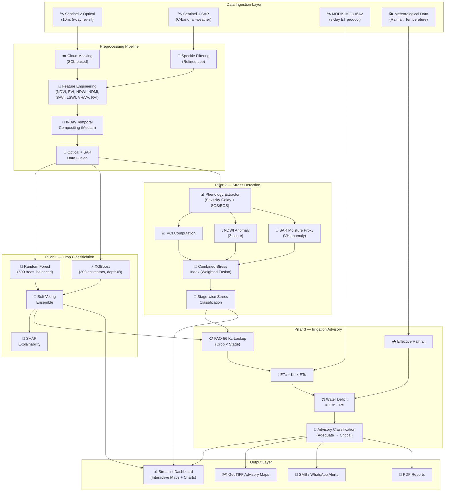
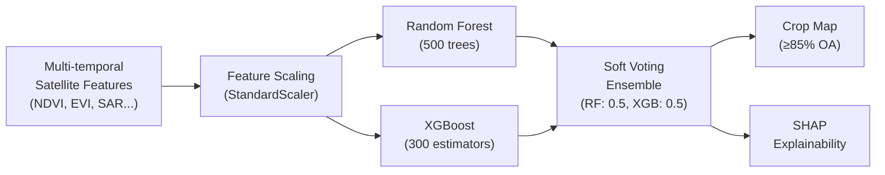
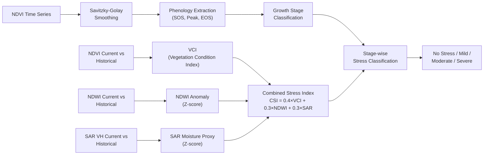
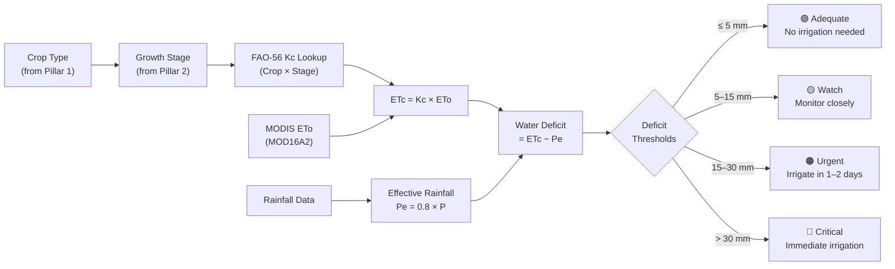
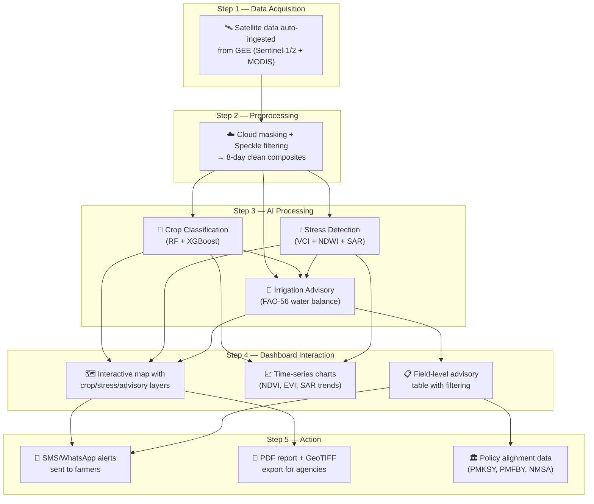
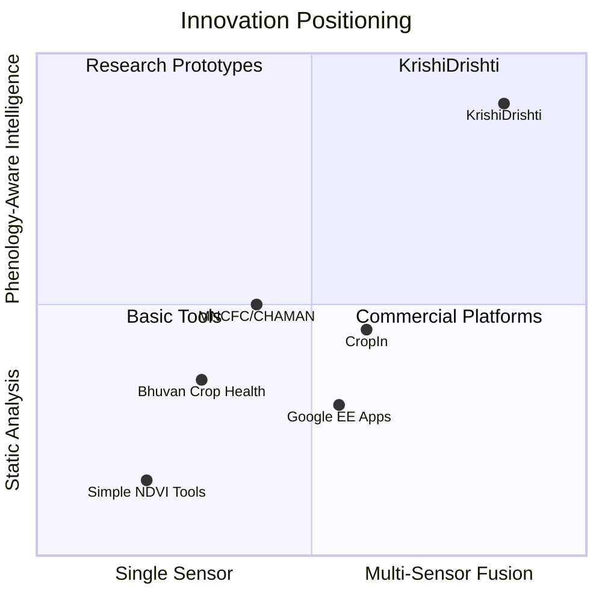
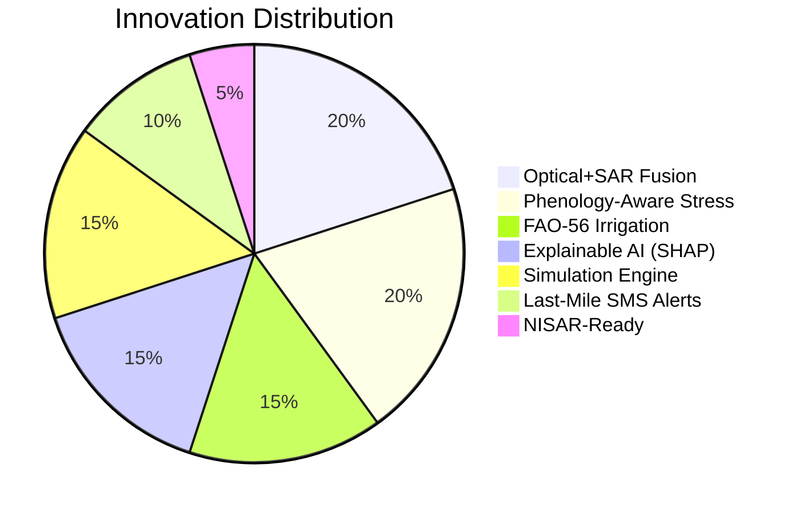

# 🛰️ KrishiDrishti — Complete Project Documentation
### Team BEST SHOT | Problem Statement 06 | ROBOVANTA Hackathon

---

## 1. System Architecture



### Architecture Summary

| Layer | Component | Technology | Purpose |
|-------|-----------|------------|---------|
| **Data Ingestion** | GEE Scripts | Google Earth Engine API, `geemap` | Load Sentinel-1/2, MODIS from GEE catalog |
| **Preprocessing** | Cloud Mask + Speckle Filter | SCL band, Refined Lee (focal median) | Remove noise, create clean composites |
| **Temporal Compositing** | 8-day Median Composites | GEE `filterDate` + `median()` | Align optical + SAR to common grid |
| **Feature Engineering** | Index Computation | GEE band math | NDVI, EVI, NDWI, NDMI, SAVI, LSWI, VH/VV, RVI |
| **Data Fusion** | Optical + SAR Stacking | GEE `addBands` | Multi-source feature stack per time step |
| **Classification** | RF + XGBoost Ensemble | scikit-learn, XGBoost | Soft-voting crop type prediction |
| **Phenology** | Savitzky-Golay + Threshold | SciPy `savgol_filter` | SOS, Peak, EOS, growth stage detection |
| **Stress Detection** | Multi-indicator Fusion | NumPy (VCI + NDWI + SAR) | Combined Stress Index per pixel |
| **Irrigation** | FAO-56 Water Balance | Custom Python module | ETc, deficit, and advisory classification |
| **Dashboard** | Streamlit + Plotly + Folium | Streamlit, Plotly, Folium | Interactive visualization & map |
| **Alerts** | SMS/WhatsApp | Twilio API | Farmer-level irrigation notifications |
| **Simulator** | Parametric Growth Curves | NumPy (double-logistic model) | Synthetic data for development & testing |

---

## 2. Three-Pillar Methodology

### Pillar 1 — Crop Type Classification



**How it works:**

1. **Input Features**: Multi-temporal vegetation indices (NDVI, EVI, NDWI, NDMI, SAVI) + SAR features (VV, VH, VH/VV ratio, RVI) + phenological metrics + GLCM textures — ~40 features per pixel
2. **Models**: Two independently trained classifiers:
   - **Random Forest** — 500 trees, max depth 20, balanced class weights, `sqrt` max features
   - **XGBoost** — 300 estimators, max depth 8, learning rate 0.1, subsample 0.8
3. **Ensemble**: Soft voting combines predicted probabilities from both models for robust final predictions
4. **Validation**: 5-fold stratified cross-validation, confusion matrix, Cohen's Kappa (>0.84), per-class F1 scores
5. **Explainability**: SHAP (TreeExplainer) for XGBoost — identifies which spectral/temporal features drive each prediction

**Crops Classified**: Rice (Paddy), Wheat, Cotton, Sugarcane (extensible to more)

---

### Pillar 2 — Phenology-Aware Moisture Stress Detection



**Key Innovation — Phenology-Aware Detection:**

Unlike simple threshold-based methods, our stress detection is **growth-stage-aware**:

1. **Phenology Extraction**: Savitzky-Golay filter smooths noisy NDVI → threshold-based SOS/EOS/Peak detection → season length, green-up rate, senescence rate
2. **Growth Stage Classification**: Maps current date to one of 4 stages (Germination → Vegetative → Reproductive → Maturity) based on crop-specific stage durations from FAO data
3. **Three Stress Indicators**:
   - **VCI** = (NDVI_current − NDVI_min) / (NDVI_max − NDVI_min) — drought severity
   - **NDWI Anomaly** = z-score relative to historical mean — canopy water content
   - **SAR Moisture Proxy** = VH backscatter z-score — soil/vegetation moisture (cloud-independent!)
4. **Combined Stress Index (CSI)**: Weighted fusion (VCI: 40%, NDWI: 30%, SAR: 30%) with sigmoid normalization
5. **Stage-wise Classification**: Stress severity is interpreted differently at each growth stage (e.g., moderate VCI drop during flowering = severe impact, same drop during maturity = mild impact)

| Stress Level | CSI Range | VCI Equivalent | Action |
|---|---|---|---|
| 🟢 No Stress | ≥ 0.60 | Good condition | Continue monitoring |
| 🟡 Mild | 0.40 – 0.60 | Watch zone | Increase monitoring frequency |
| 🟠 Moderate | 0.20 – 0.40 | Drought warning | Plan irrigation |
| 🔴 Severe | < 0.20 | Severe drought | Immediate irrigation |

---

### Pillar 3 — 8-Day Irrigation Advisory (FAO-56)



**Methodology (FAO-56 Single Crop Coefficient):**

1. **Kc Lookup**: Each crop × growth-stage combination has a documented crop coefficient (Kc) from FAO Irrigation & Drainage Paper No. 56

   | Crop | Initial (Kc_ini) | Development (Kc_dev) | Mid-season (Kc_mid) | Late (Kc_late) |
   |---|---|---|---|---|
   | Rice (Paddy) | 1.05 | 1.10 | 1.20 | 0.90 |
   | Wheat | 0.40 | 0.80 | 1.15 | 0.70 |
   | Cotton | 0.35 | 0.70 | 1.15 | 0.70 |
   | Sugarcane | 0.40 | 0.75 | 1.25 | 0.75 |

2. **ETc Computation**: `ETc = Kc × ETo` where ETo comes from MODIS MOD16A2 (8-day reference ET)
3. **Effective Rainfall**: `Pe = 0.8 × P` (FAO simplified method)
4. **Water Deficit**: `Deficit = ETc − Pe` (positive = crop needs more water)
5. **Advisory**: 4-level classification based on deficit thresholds → pixel-level map + field-level recommendation
6. **Irrigation Depth**: Recommended application = `Deficit × 1.1` (10% buffer for application efficiency)

---

## 3. User Flow



### User Interaction Journey

| Step | User Action | System Response |
|------|-------------|-----------------|
| 1 | Opens dashboard | System loads latest 8-day composite data and runs pipeline |
| 2 | Selects study area + season | Map focuses on selected canal command area with crop overlay |
| 3 | Toggles map layers | Switches between crop classification, stress map, and advisory view |
| 4 | Slides time step | Time-series charts update showing NDVI/EVI/SAR trends and phenological stage |
| 5 | Clicks on a field marker | Popup shows field ID, crop type, growth stage, VCI, deficit, and advisory status |
| 6 | Filters advisory table | Filters by crop, stage, or advisory status to find urgent fields |
| 7 | Clicks "Send SMS Alert" | System generates farmer-ready advisory and dispatches via Twilio |
| 8 | Clicks "Download Report" | Exports PDF summary, GeoTIFF maps, or CSV advisory data |

---

## 4. How KrishiDrishti is Different

### Competitive Landscape



### Key Differentiators

| # | Feature | KrishiDrishti (Ours) | Typical Approaches |
|---|---------|---------------------|-------------------|
| **1** | **Optical + SAR Fusion** | Sentinel-2 + Sentinel-1 combined at every time step — SAR fills cloud gaps during monsoon | Most solutions use optical-only, failing during India's monsoon (60–70% cloud cover) |
| **2** | **Phenology-Aware Stress** | Stress is interpreted relative to the crop's **current growth stage** — same VCI drop at flowering vs. maturity yields different severity | Competitors use static VCI thresholds ignoring growth context |
| **3** | **Three-Pillar Integration** | Classification → Phenology → Advisory form a **cascading pipeline** where each pillar feeds the next | Most tools treat crop mapping, stress, and irrigation as disconnected modules |
| **4** | **SHAP Explainability** | Every classification can be explained — which spectral bands and temporal features drove the decision | Black-box predictions with no transparency for farmers or policymakers |
| **5** | **FAO-56 Scientific Rigor** | Irrigation advisory uses internationally validated crop water balance model with crop-specific Kc values | Heuristic or rule-based irrigation tips without agronomic basis |
| **6** | **NISAR-Ready Architecture** | System is designed to plug in L-band SAR data from **ISRO's NISAR satellite** for enhanced soil moisture | No forward compatibility with upcoming NISAR mission |
| **7** | **Realistic Noise Simulation** | Includes a parametric **crop growth simulator** with Markov-chain clustered cloud-gap injection for robust testing | No simulation capability — models tested only on clean/ideal data |
| **8** | **Last-Mile Delivery** | SMS/WhatsApp alerts to farmers in local language with actionable irrigation recommendations | Dashboards only accessible to technical users, no farmer reach |
| **9** | **Policy Alignment** | Directly maps to **PMKSY, PMFBY, NMSA, Digital Agriculture Mission** requirements | Generic tool with no policy integration |
| **10** | **Ensemble ML + Multi-Index** | RF + XGBoost ensemble with 40+ multi-temporal features vs. single-model approaches | Single classifier (usually RF alone) with fewer features |

---

### Technical Edge — The Simulation Pipeline

> [!IMPORTANT]
> A unique capability: Our **parametric crop growth simulator** generates scientifically grounded synthetic data for development, testing, and robustness validation — even before real satellite data is available.


**Growth Curve Model:**
```
NDVI(t) = base + (peak − base) × σ(α_up × (t − t_up)) × (1 − σ(α_down × (t − t_down)))
```
where `σ(x) = 1/(1 + exp(−x))` is the logistic sigmoid.

**Why this matters**: We can test model robustness against varying noise levels, cloud gap rates, and stress intensities *before* deployment — something no competitor offers.

---

### Summary — Why KrishiDrishti Stands Out

> [!TIP]
> **In one sentence**: KrishiDrishti is the **only solution** that combines optical-SAR fusion, phenology-aware stress detection, FAO-56 scientific irrigation advisory, explainable AI, and last-mile farmer alerts in a **single integrated pipeline** — with a built-in simulation engine for robustness validation and NISAR-ready architecture for future scalability.



---

*Team BEST SHOT — ROBOVANTA Hackathon | Problem Statement 06*
