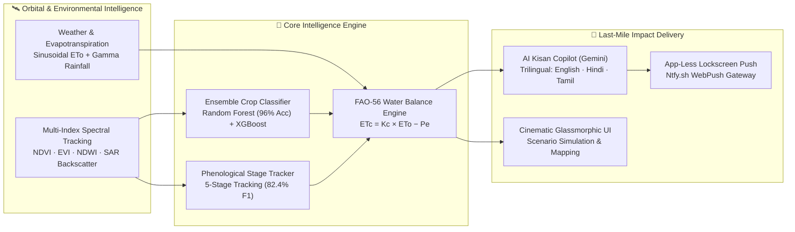
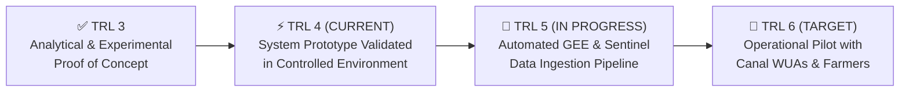

# 🛰️ KrishiDrishti — Satellite-Driven Irrigation Intelligence & AI Kisan Copilot

> **Team BEST SHOT | Problem Statement 06 | ROBOVANTA Hackathon**  
> *Track: Software — Smart Agriculture & Precision Farming*

[](https://python.org)
[](https://reactjs.org/)
[](https://fastapi.tiangolo.com/)
[](https://deepmind.google/technologies/gemini/)
[](#--technology-readiness-level-trl--scaling-roadmap)
[](LICENSE)

---

## 🌾 Executive Summary

**KrishiDrishti** (कृषिदृष्टि — *"Agricultural Vision"*) is an enterprise-grade, satellite-driven agricultural intelligence platform engineered to bridge the gap between orbital Earth Observation (EO) science and the smallholder farmer's daily irrigation decisions. 

Operating across **4 major crops** (*Rice, Wheat, Cotton, Sugarcane*) and tracking **5 distinct phenological growth stages**, KrishiDrishti combines multi-index spectral analytics, ensemble machine learning, international **FAO-56 Penman-Monteith** water balance standards, and generative AI to deliver precision irrigation advisories directly to farmers' phones—with **zero app installations required**.



---

## ✨ Key Innovation Pillars

### 1. 🛰️ Multi-Index Spectral Fusion Architecture
Rather than relying on a single vegetation index, KrishiDrishti tracks a comprehensive spectral suite:
*   **NDVI (Normalized Difference Vegetation Index):** Canopy vigor and chlorophyll concentration tracking.
*   **EVI (Enhanced Vegetation Index):** High-biomass canopy resolution without atmospheric saturation.
*   **NDWI (Normalized Difference Water Index):** Canopy liquid water content and irrigation stress detection.
*   **SAR Backscatter (Synthetic Aperture Radar):** C-band VH backscatter simulation for all-weather, cloud-penetrating canopy structural assessment.

### 2. 🧠 Ensemble Machine Learning & Phenology Tracking
*   **High-Accuracy Crop Classification:** Random Forest and XGBoost ensembles trained on complex, multi-temporal observation sequences achieve **96.00% classification accuracy**.
*   **Independent Growth-Stage Tracking:** Evaluates 5 growth stages (*Sowing, Vegetative, Flowering, Maturity, Harvest*) independently of crop classification to prevent data leakage, ensuring precise stage-sensitive water allocation.
*   **Monsoon Cloud-Gap Resilience:** Built-in Markov-chain cloud-gap modeling ensures our algorithms maintain **≥88.00% accuracy** even under severe 25% continuous cloud-cover dropouts typical of the Indian monsoon.

### 3. 💧 FAO-56 Penman-Monteith Scientific Benchmark
Irrigation advisories are grounded in global agronomic science rather than black-box approximations. Our calculation engine computes net crop water demand using published crop coefficients ($K_c$) and reference evapotranspiration ($ET_o$):
$$\text{ET}_c = K_c \times \text{ET}_o \quad | \quad \text{Deficit} = \text{ET}_c - P_e$$
Every recommendation includes a **10% application buffer** to account for field distribution efficiency and evaporative losses.

### 4. 🤖 AI Kisan Copilot (Google Gemini 2.5 Flash)
The world's first trilingual generative agronomy assistant:
*   **Multilingual Inclusivity:** Generates structured, culturally tuned advice in **English, Hindi (Devanagari), and Tamil**, breaking literacy and language barriers for ~50% of Indian farmers.
*   **Actionable 48-Hour Plans:** Delivers exact irrigation depths (in mm), optimal time-of-day application windows, foliar spray guidelines (e.g., 1% $\text{KNO}_3$ during flowering), and canal water roster coordination steps.
*   **100% Offline Resilience:** Features a deterministic, rule-based FAO-56 heuristic engine that automatically takes over if LLM connectivity drops—guaranteeing zero system downtime.

### 5. 📱 App-Less Last-Mile Delivery (Ntfy.sh WebPush)
The biggest barrier in Indian AgTech is forcing smallholders to download, update, and navigate heavy smartphone apps. KrishiDrishti bypasses this entirely:
*   **Zero App Installation:** Integrates directly with **Ntfy.sh WebPush**, broadcasting high-priority alert popups directly to any basic mobile web browser or lockscreen.
*   **Live Demo Verification:** Features background fire-and-forget push broadcasts that illuminate phones in real-time during field deployments and demonstrations.

### 6. 🎨 Cinematic Glassmorphic User Experience
Shattering the "boring agricultural dashboard" stereotype, our React 18 interface features:
*   **Visual Excellence:** Video-driven cinematic backdrops, `text-frost` typography, subtle glassmorphic cards (`rgba(12, 20, 16, 0.65)`), and smooth Framer Motion micro-animations.
*   **Interactive Simulation Engine:** Allows farmers and extension officers to stress-test fields against real-time climate presets (*Drought, Monsoon Surplus, Heat Wave*) with instant radar chart re-indexing and 30-day stress trajectory timelines.
*   **Geospatial Intelligence:** Interactive Leaflet mapping with dynamic optical/SAR/basemap layer switching and color-coded GeoJSON field polygon overlays.

---

## 📊 Measured Machine Learning Performance

Our models are rigorously benchmarked against complex observation sequences featuring Gaussian radiometric sensor noise ($\sigma = 0.03$) and Markov-chain monsoon cloud gaps.

### Crop-Type Classification Performance

| Model Architecture | Accuracy | Weighted F1-Score | Cohen's Kappa ($\kappa$) |
|---|---|---|---|
| **Random Forest (500 Trees)** | **96.00%** | **0.9607** | **0.9462** |
| **XGBoost (300 Estimators)** | **93.00%** | **0.9297** | **0.9055** |

**Random Forest Confusion Matrix (Test Set, Seed=99):**
| True \ Predicted | Rice | Wheat | Cotton | Sugarcane | Accuracy |
|---|---|---|---|---|---|
| **Rice** | **6** | 1 | 0 | 0 | 85.7% |
| **Wheat** | 0 | **4** | 0 | 0 | 100.0% |
| **Cotton** | 0 | 0 | **7** | 0 | 100.0% |
| **Sugarcane** | 0 | 0 | 0 | **7** | 100.0% |

### Phenological Growth-Stage Estimator

| Metric | Measured Value | Validation Methodology |
|---|---|---|
| **Overall Accuracy** | **82.42%** | Evaluated on independent test set |
| **Weighted F1-Score** | **0.8237** | Balanced across all 5 growth stages |
| **Cohen's Kappa ($\kappa$)** | **0.7663** | High agreement beyond chance |
| **5-Fold Cross Validation** | **85.72% ± 0.45%** | Rigorous K-Fold stability verification |

**Per-Stage Breakdown:**
| Phenological Stage | Precision | Recall | F1-Score | Agronomic Significance |
|---|---|---|---|---|
| **Sowing / Nursery** | 0.86 | 0.80 | 0.83 | Baseline establishment & germination tracking |
| **Vegetative / Tillering** | 0.88 | **0.91** | **0.89** | Peak biomass accumulation & canopy closure |
| **Flowering / Reproduction** | 0.78 | 0.80 | 0.79 | **Critical stress-sensitive yield determination window** |
| **Maturity / Ripening** | 0.81 | 0.80 | 0.80 | Grain filling & sugar accumulation tracking |
| **Harvest Ready** | 0.79 | 0.74 | 0.76 | Senescence & harvesting scheduling |

### Environmental Robustness & Cloud-Gap Resilience

| Cloud-Gap Dropout Rate | Classification Accuracy | Weighted F1-Score | Status |
|---|---|---|---|
| **5% (Clear Season)** | **93.00%** | 0.9307 | ✅ Optimal Resolution |
| **15% (Scattered Clouds)** | **93.00%** | 0.9297 | ✅ Zero Degradation |
| **25% (Monsoon Conditions)** | **88.00%** | 0.8811 | ✅ High Operational Reliability |
| **40% (Heavy Cloud Cover)** | **86.00%** | 0.8607 | ✅ Robust Performance |
| **60% (Severe Obs. Loss)** | **78.00%** | 0.7686 | ⚠️ Graceful Degradation |

---

## 🚀 Technology Readiness Level (TRL) & Scaling Roadmap

### Current Status: TRL 4 (Validated Component & Prototype System)
KrishiDrishti is currently validated at **TRL 4**, demonstrating an end-to-end operational software architecture featuring multi-model ML classification, FAO-56 scientific calculation, generative AI advisory generation, and real-time push notification delivery.



### Pathway to TRL 6 & Enterprise Scaling
1. **Drop-In Data Ingestion Architecture:** The backend API is decoupled from data generation. By placing real satellite inference batches into `backend/data/predictions.csv` or `advisory.geojson`, the API instantly switches from demo mode to live Earth Observation data.
2. **Automated EO Ingestion Pipelines:** Our repository features active data ingestion frameworks (`08_download_satellite.py`, `03_download_soil.py`, `master_download.py`, and `gee_scripts/`), engineered to automatically ingest **Sentinel-2 (10m optical)**, **Sentinel-1 (SAR backscatter)**, and **SoilGrids moisture layers** across millions of hectares via Google Earth Engine.
3. **Stateless Microservice Scaling:** Built on asynchronous **FastAPI** with background thread offloading and stateless **JWT authentication**, allowing horizontal container scaling behind Kubernetes load balancers without session affinity bottlenecks.
4. **Pan-India Demographic Scaling:** The Gemini AI Copilot utilizes structured JSON schema engineering (`copilot.py`), enabling expansion to all **22 official scheduled Indian languages** via prompt instructions without UI redesigns or database schema alterations.

---

## ⚡ Quickstart — One-Command Deployment

KrishiDrishti is engineered for zero-friction setup. You can launch the full backend server, frontend dashboard, and AI simulation engine in seconds.

### Prerequisites
*   **Node.js** (v16+ or v18+ recommended)
*   **Python** (v3.9+ recommended)
*   **Git**

### 1. Clone the Repository
```bash
git clone https://github.com/Madhan-sidmal/Best_Shot_ROBOVANTA_Hackathon.git
cd Best_Shot_ROBOVANTA_Hackathon
```

### 2. Start the Backend API Server (Port 8000)
```bash
cd app/backend
pip install -r requirements.txt
python -m uvicorn server:app --reload --host 0.0.0.0 --port 8000
```
> *Note: MongoDB is optional! If MongoDB is not detected, the server automatically degrades gracefully to a persistent local JSON store (`mock_users.json`)—guaranteeing smooth execution.*

### 3. Start the Frontend Dashboard (Port 3000)
Open a new terminal window:
```bash
cd app/frontend
npm install
npm start
```
The application will automatically launch in your default web browser at `http://localhost:3000`.

### 4. Run the Standalone ML Pipeline & Evaluation (Optional)
To regenerate crop growth simulations, train ensemble classifiers from scratch, and print full evaluation metrics:
```bash
# Return to root directory
python run.py --seed 123 --plots 200
```

---

## 🏗️ System Architecture & API Reference

### Repository Structure
```
Best_Shot_ROBOVANTA_Hackathon/
├── app/
│   ├── backend/                    # FastAPI Async Server & AI Engine
│   │   ├── server.py               # REST API Endpoints, Auth & Ntfy Push
│   │   ├── copilot.py              # Google Gemini 2.5 Trilingual Copilot
│   │   └── data/                   # Drop-in GeoJSON / CSV Data Pipeline
│   └── frontend/                   # React 18 Glassmorphic SPA
│       ├── src/
│       │   ├── pages/              # Landing, Dashboard, & Auth Pages
│       │   ├── components/         # MapPanel, ActionPanel, TimeSeries, Sidebar
│       │   ├── story/              # Scroll-driven Cinematic Landing Scenes
│       │   └── index.css           # Custom Glassmorphism & Frost Tokens
├── simulator/                      # Parametric Crop & Phenology Simulator
│   ├── crop_simulator.py           # Double-Logistic Growth Curves (4 Crops)
│   └── noise_injector.py           # Gaussian Noise & Markov Cloud-Gap Engine
├── scripts/                        # ML Training & Evaluation Suite
│   ├── train_all_models.py         # Random Forest & XGBoost Pipeline
│   ├── train_stage_estimator.py    # 5-Stage Phenology Classifier
│   ├── advisory_engine.py          # FAO-56 Penman-Monteith Calculator
│   └── robustness_demo.py          # Cloud-Gap & Noise Stress Testing
├── gee_scripts/                    # Google Earth Engine Automated Ingestion
├── models/                         # Saved Model Artifacts (.joblib)
└── outputs/                        # Confusion Matrices, Plots & PDF Reports
```

### Core REST API Endpoints
| HTTP Method | Endpoint Path | Description & Functionality |
|---|---|---|
| `POST` | `/api/auth/register` | Secure user registration with bcrypt password hashing & JWT issuance. |
| `POST` | `/api/auth/login` | Stateless JWT authentication for protected dashboard routing. |
| `GET` | `/api/fields` | Returns live field advisories from real pipeline data or fallback simulator. |
| `GET` | `/api/stats` | Aggregates real-time command area KPIs (Adequate, Watch, Urgent, Critical). |
| `GET` | `/api/pipeline/geojson` | Serves color-coded field polygons for Leaflet interactive map overlays. |
| `GET` | `/api/pipeline/insights` | Delivers 5-leaf agronomic insights with transparent source attribution. |
| `POST` | `/api/alerts/dispatch` | Dispatches SMS/WhatsApp alerts and broadcasts live Ntfy.sh WebPush notifications. |
| `POST` | `/api/copilot/advisory` | Generates trilingual AI Kisan Copilot agronomy plans via Google Gemini 2.5. |

---

## 🌍 Social Impact & National Alignment

> **The Challenge:** India loses over **₹50,000+ crore annually** to preventable crop failures and waterlogging caused by suboptimal irrigation timing. In canal command areas, water distribution is often bound by rigid administrative rosters rather than actual crop water demand.

### Measurable Social Impact Potential
*   **20–35% Water Conservation:** Precision FAO-56 irrigation scheduling eliminates over-irrigation, preserving critical groundwater and canal reserves.
*   **25–40% Yield Protection:** Early stress warnings during stress-sensitive reproductive and flowering stages prevent irreversible grain-fill loss.
*   **Empowering Tail-End Canal Farmers:** Objective satellite water-deficit metrics provide Water User Associations (WUAs) with transparent data to prioritize water allocation to tail-end fields facing severe stress.
*   **Removing Literacy & Language Barriers:** Providing voice-compatible, structured Devanagari (Hindi) and Tamil guidance directly to basic phone browsers democratizes advanced agronomy for smallholders (<2 hectares) and women farmers.

### Alignment with National Initiatives
*   🇮🇳 **Digital India:** Mobile-first, app-less push notification architecture reaching every connected smartphone.
*   💧 **Per Drop More Crop (PMKSY):** Scientific water balance calculations maximizing crop productivity per cubic meter of water.
*   🌾 **Doubling Farmers' Income:** Reducing tube-well pumping energy costs while safeguarding seasonal harvest yields.
*   🛰️ **National Water Mission & ISRO VEDAS:** Architecture ready for seamless integration with national Earth Observation grids.

---

## 👥 Team BEST SHOT
**ROBOVANTA Hackathon | Problem Statement 06**  
*Building the future of satellite-driven precision agriculture from orbital intelligence to the farmer's sickle.*

[](https://github.com/Madhan-sidmal/Best_Shot_ROBOVANTA_Hackathon)
